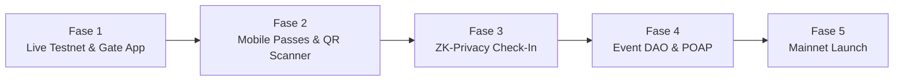

# StellarPass: Roadmap & Rencana Pengembangan Selanjutnya 🚀

Dokumen ini merangkum **posisi proyek saat ini**, capaian yang telah diselesaikan, serta **rencana aksi tahap berikutnya (Next Phases)** secara terstruktur dan komprehensif.

---

## 📊 Status Capaian Saat Ini (Completed Milestones)

| Komponen | Status | Penjelasan |
|---|---|---|
| **Multi-Event Factory** | ✅ Selesai | 1 smart contract mengelola ribuan event mandiri (`create_event`). |
| **Metadata Tiket Lengkap** | ✅ Selesai | Judul acara, venue, tanggal (Unix timestamp), nomor kursi tersimpan on-chain. |
| **Batch Minting** | ✅ Selesai | Admin dapat mencetak banyak tiket sekaligus dalam 1 transaksi atomik. |
| **Batas Harga Sekunder** | ✅ Selesai | Batas harga maksimal (face value + 10%) dikunci di level smart contract. |
| **Royalti Otomatis** | ✅ Selesai | Hingga 50% royalti sekunder langsung ditransfer ke organizer secara instan. |
| **Two-Tier Rate Limiter** | ✅ Selesai | Batas kuota per dompet (`max_tickets_per_wallet`) & jeda transfer anti-bot (`cooldown`). |
| **Keamanan Pembayaran** | ✅ Selesai | Validasi ketat token resmi (`payment_token`), menangkal token palsu. |
| **Mekanisme Refund** | ✅ Selesai | Pengembalian dana face value oleh organizer dengan penyesuaian kuota. |
| **Circuit Breaker** | ✅ Selesai | Fitur pause darurat (`set_paused`) untuk membekukan operasi saat ada insiden. |
| **Unit Test Coverage** | ✅ Selesai | **18 unit test hermetis** di `test.rs` lulus 100% tanpa warning. |
| **WASM Optimization** | ✅ Selesai | Binary `stellarpass_ticketing.wasm` teroptimasi (~23.6 KB). |
| **Next.js Frontend DApp** | ✅ Selesai | Integrasi Freighter wallet, galeri tiket, dan portal resale (aksesibel WCAG AA). |

---

## 🗺️ Rencana Fase Pengembangan Selanjutnya (Next Phases)

---

### 📍 FASE 1: Live Testnet Deployment & E2E Validation (Prioritas Terdekat)

**Tujuan:** Memindahkan sistem dari simulasi mock test ke jaringan live **Stellar Testnet** dengan dompet Freighter asli.

1. **Deploy Kontrak ke Testnet:**
   - Deploy binary `stellarpass_ticketing.wasm` menggunakan Soroban CLI.
   - Catat ID kontrak testnet resmi ke `frontend/.env.local`.
2. **Setup Test Payment Token:**
   - Gunakan Testnet SAC (Stellar Asset Contract) untuk simulasi token pembayaran (misal testnet USDC atau wrap XLM).
3. **Inisialisasi Event Perdana (Event #1):**
   - Jalankan `create_event` di Testnet dengan parameter produksi (kuota 4 tiket, cooldown 60 detik, royalti 5%).
4. **End-to-End Testing di Browser:**
   - Buka frontend Next.js lokal, sambungkan Freighter, mint tiket testnet, dan uji coba transfer resale antar-akun Stellar asli.

---

### 📍 FASE 2: Gate Scanner PWA & Mobile Wallet Integration

**Tujuan:** Memberikan kemudahan bagi panitia di pintu masuk (gate) dan penonton di smartphone mereka.

1. **Aplikasi Gate Scanner (PWA):**
   - Buat halaman khusus `/gate-scanner` di frontend dengan akses kamera smartphone (menggunakan library `@zxing/browser` atau `html5-qrcode`).
   - Scanner membaca payload QR dinamis dari penonton, memverifikasi tanda tangan off-chain dalam hitungan milidetik, lalu memicu transaksi `check_in` ke Soroban.
2. **Integrasi Apple Wallet & Google Wallet (.pkpass):**
   - Tambahkan tombol *"Add to Apple Wallet / Google Wallet"*.
   - Menggunakan backend service ringan untuk menandatangani pass digital standar iOS/Android yang memperbarui QR dinamis secara berkala.

---

### 📍 FASE 3: Zero-Knowledge (ZK) Privacy Check-In

**Tujuan:** Privasi penonton di pintu masuk acara.

1. **Konsep:**
   - Saat ini check-in mengekspos public key penonton di scanner pintu gerbang.
   - Dengan ZK-Proof (misal zk-SNARKs / Groth16 verifier on Soroban), penonton membuktikan bahwa mereka memiliki tiket sah yang terdaftar dalam Merkle Tree acara **tanpa mengungkapkan alamat dompet atau identitas mereka**.
2. **Pencegahan Double-Entry:**
   - Menggunakan *Nullifier* on-chain untuk memastikan satu bukti ZK hanya bisa dipakai masuk satu kali.

---

### 📍 FASE 4: Event DAO & Proof of Attendance (POAP)

**Tujuan:** Retensi komunitas dan keterlibatan penonton pasca-acara.

1. **Governance Penonton (DAO):**
   - Pemegang tiket memiliki hak suara on-chain untuk menentukan keputusan acara (misal: voting lagu encore, pemilihan band pembuka, atau alokasi donasi sosial).
2. **Koleksi Kenangan Digital (POAP / Soulbound Token):**
   - Tiket yang telah berstatus `USED` (telah discan di gate) dapat di-claim menjadi badge souvenir digital (Soulbound NFT) yang tidak bisa dijual kembali, sebagai bukti kehadiran bersejarah penonton.

---

### 📍 FASE 5: Stellar Mainnet Launch & Kesiapan Komersial

**Tujuan:** Peluncuran resmi di mainnet Stellar untuk acara komersial nyata.

1. **Audit Keamanan Pihak Ketiga:**
   - Pemeriksaan formal smart contract oleh auditor independen ekosistem Stellar.
2. **Integrasi USDC Stellar Resmi:**
   - Mengikat `payment_token` ke kontrak resmi Circle USDC di Stellar Public Network (`GA5ZSEJYB37JRC5AVCIA5MOP4RHTM335X2KGX3IHOJAPP5RE34K4KZVN`).
3. **Pilot Project Acara Nyata:**
   - Bekerja sama dengan promotor musik, konferensi teknologi, atau komunitas lokal untuk uji coba ticketing live pertama.

---

## 🛠️ Langkah Teknis Konkret yang Bisa Dilakukan Sekarang

Jika Anda ingin langsung melanjutkan pengembangan, berikut pilihan langkah berikutnya yang direkomendasikan:

* **Opsi A (Paling Dianjurkan):** Melakukan deployment perdana ke **Stellar Testnet**, membuat Event #1 secara live, dan mencobanya langsung di web UI dengan Freighter.
* **Opsi B:** Membangun fitur **Gate Scanner PWA** (halaman pemindai QR berbasis kamera untuk petugas pintu gerbang).
* **Opsi C:** Menambahkan portal admin di frontend (UI dashboard agar organizer bisa membuat event baru, melihat sisa kuota tiket, dan pause event tanpa perlu mengetik CLI).

---

*StellarPass — Solusi Tiket Masa Depan yang Adil, Transparan, dan Bebas Calo.* 🎟️✦
